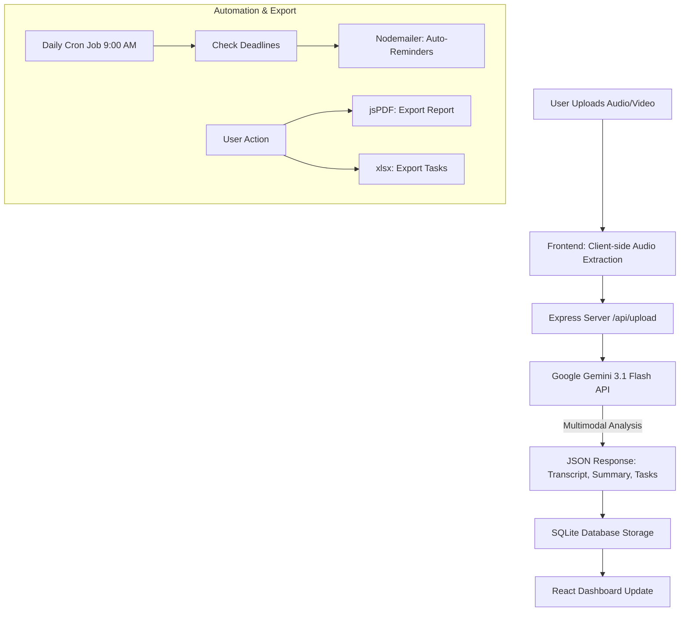

# MeetingAI Assistant - Technical Documentation

## 1. Project Overview
MeetingAI Assistant is a full-stack productivity tool that automates the process of transcribing meeting audio and video, summarizing discussions, and extracting actionable tasks. It uses advanced AI to identify task owners, deadlines, and priorities, providing a centralized dashboard for team follow-ups.

## 2. Workflow Diagram



## 3. Technical Stack
- **Frontend**: React 18, TypeScript, Tailwind CSS, Framer Motion, Lucide Icons.
- **Backend**: Node.js, Express.js, Multer (File Uploads), Node-Cron (Automation).
- **Database**: SQLite (via `better-sqlite3`) - Relational storage for meetings and tasks.
- **AI Engine**: Google Gemini 3.1 Flash (Native Multimodal Processing).
- **Audio Processing**: Web Audio API (Client-side extraction from video).
- **Email**: Nodemailer (SMTP Integration).
- **Reporting**: jsPDF (PDF Generation), XLSX (Excel Export).

## 4. Key Features & Implementation Details

### 4.1 Video & Audio Processing
The system supports both audio and video files.
- **Video Support**: When a video is uploaded, the frontend uses the **Web Audio API** and **OfflineAudioContext** to extract the audio track client-side. This ensures high-speed processing and stays within AI payload limits.
- **AI Analysis**: The extracted audio is sent to Gemini 3.1 Flash for native multimodal analysis.

### 4.2 AI Transcription & Extraction
- **Input**: Raw audio bytes + System Prompt.
- **Logic**: The AI performs linguistic analysis to map tasks to specific people based on conversational context.
- **Output**: Structured JSON following a strict schema (`transcript`, `summary`, `tasks[]`).

### 4.3 Automated Reminders & Scheduling (Cron Service)
A background service runs daily to ensure no task is forgotten.
- **Schedule**: `0 9 * * *` (Every day at 9:00 AM).
- **Logic**: Queries the database for `Pending` tasks where `deadline` is tomorrow and `auto_alert_enabled` is true.
- **Action**: Sends a professional email reminder via SMTP.
- **Visual Feedback**: Tasks scheduled for auto-alerts are marked with a "SCHEDULED" badge in the UI.

### 4.3 Data Persistence
- **Relational Schema**:
    - `meetings`: Stores transcript, summary, and metadata.
    - `tasks`: Linked to `meetings` via `meeting_id`. Stores title, owner, deadline, priority, and email.
- **Migrations**: The server automatically handles database schema updates on startup.

### 4.4 Export Engine
- **PDF**: Uses `jspdf-autotable` to create structured meeting minutes.
- **Excel**: Uses `xlsx` to generate spreadsheet-compatible task lists.

## 5. Setup & Configuration
To run the project locally, the following environment variables are required in a `.env` file:

```env
GEMINI_API_KEY="your_gemini_key"
EMAIL_HOST="smtp.gmail.com"
EMAIL_PORT="587"
EMAIL_USER="your-email@gmail.com"
EMAIL_PASS="your-app-password"
```

## 6. API Endpoints
- `POST /api/upload`: Handles audio file storage.
- `GET /api/tasks`: Retrieves all tasks sorted by deadline.
- `POST /api/tasks`: Manually add a task.
- `PUT /api/tasks/:id`: Update task details (status, email, etc.).
- `POST /api/send-email`: Trigger a manual email reminder.
- `GET /api/meetings/latest`: Fetch the most recent meeting results.
